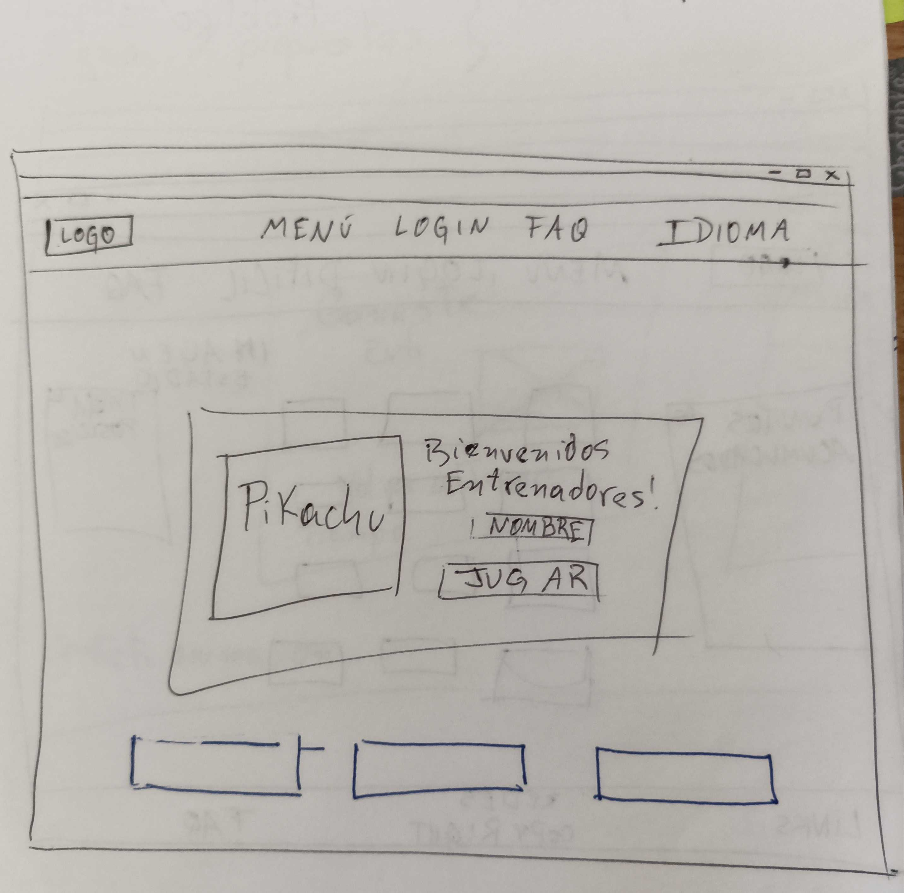
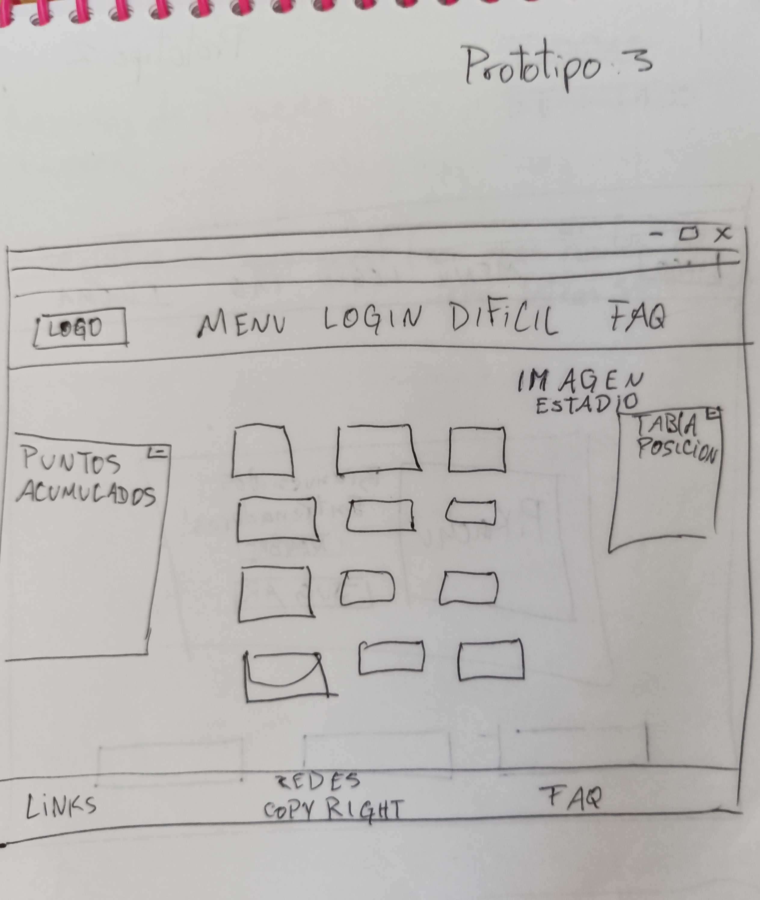
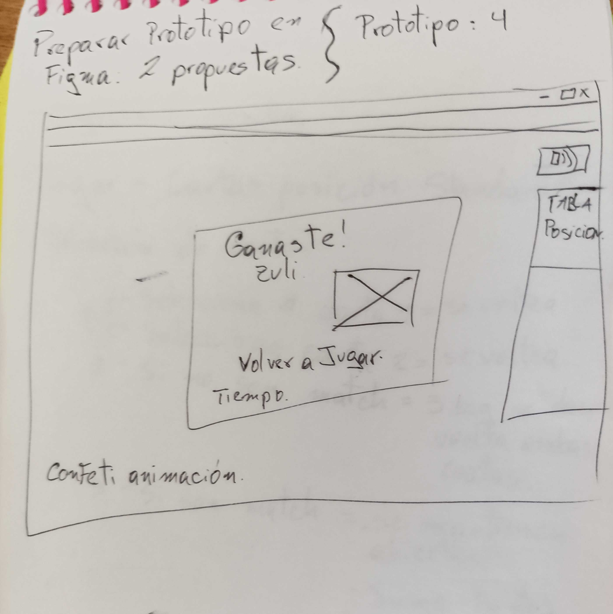

# Memory Match Game

## 1. DEFINICION DEL PRODUCTO
El juego de Memory Match de Pokemon, es un juego que tiene como objetivo que el usuario encuentre el match de todas las cartas.
Definimos que el usuario va a ser un niño, que al final del juego se convierta en un entrenador Pokemon.

Cuales son los componentes principales de la interfaz de nuestro proyecto:
- Se ingresa el nombre.
- Se   visualiza el set de cartas y se inicia el juego.
- Se consiguen la mayor cantidad de cartas iguales.
- Se convierte el usuario  en un entrenador pokemon.

## 2. HISTORIAS DE USUARIOS
Los criterios de aceptacion los tomamos a traves de un google form, que nos arrojo una informacion detallada.
- Historia 1, se puede escribir el nombre del jugador o usuario.
  El usuario queria empezar el juego imprimiendo su nombre para poder interactuar con la interfaz, se despliega un modal para colocar el nombre y/o en su defecto podria salir del modal con la X y asi continuar con el juego.

- Historia 2, se ve el set de cartas impresa en pantalla, con los pasos a seguir a un lado. En nuestra encuentas preguntamos como les gustaria que fueran la forma de las cartas, y tuvimos un empate entre la forma cuadrada y redonda, por lo cual decidimos hacerlas cuadradas con una imagen de la pokebola que es redonda.
Luego, las cartas quedarian barajadas a traves de la funcion shuffle. 

- Historia 3, selecciona 2 cartas y estas se voltean y si hacen match las cartas quedan volteadas, ademas no podras clickear las cartas que hicieron match. Si no hacen match  se daran vuelta y podras seguir intentandolo, hasta que puedas encontarlas todas.

- Historia 4, luego de terminar el juego encontrando todas las parejas de todos los pokemones, te saldra un modal donde te felicitara para que lo sigas intentando y convertirte en un Entrenador Pokemon.
Tambien podras regresar al inicio del juego con un boton que te redireccionara al inicio.

 # Prototipo de baja fidelidad

A continuacion nuestro prototipo de Baja Fidelidad 

# Prototipo de alta fidelidad

https://www.figma.com/proto/6eLrWxVSAQsBTwNhDqWnXe/MEMORY-MATCH-2?node-id=2%3A12&scaling=scale-down&page-id=0%3A1&starting-point-node-id=2%3A12

# Testeos de usabilidad 

Hicimos un testeo de usabilidad y nos arrojo que la pagina no era responsive en algunas pantallas, como el de los celulares.
Tambien nos indicaron que se le podria agregar un marcador de tiempo para hacerlo mas competitivo.

